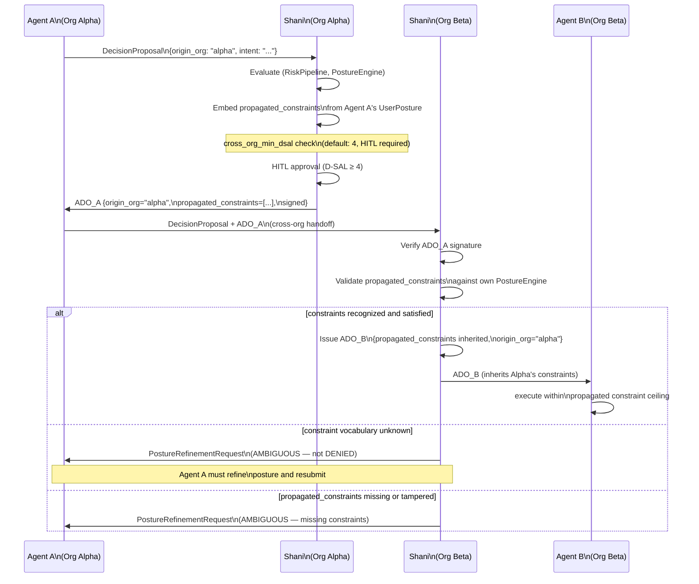

# Cross-Organizational ADO Propagation

Flow for ADO propagation across organizational boundaries (ADO v5.1, Shani v0.4).



## Normative requirements (v0.4)

| Requirement | Description |
|---|---|
| `cross_org_min_dsal` | Minimum D-SAL for any cross-org ADO. Default **4** (Board-level, HITL required). |
| Embed on issue | Issuing Shani MUST embed `propagated_constraints` from principal's `UserPosture`. |
| Validate on receipt | Receiving Shani MUST validate `propagated_constraints` against its own PostureEngine. |
| Unknown vocabulary | Receiving Shani that cannot validate constraints MUST return `PostureRefinementRequest` (AMBIGUOUS), never silently pass. |
| Signature coverage | `propagated_constraints` and `origin_org` MUST be in the canonical signed payload. Mutation breaks verification. |
| Missing constraints | Cross-org ADO without `propagated_constraints` MUST be treated as AMBIGUOUS. |

## Constraint propagation invariant

```
Alpha declares: target_scope = "domestic-only"
                ↓ embedded in ADO_A (signed)
Beta receives:  propagated_constraints includes target_scope
                ↓ validated by Beta's PostureEngine
Delta executes: international action BLOCKED
                (constraint ceiling inherited through A→B→C→D chain)
```

Alpha's constraint is cryptographically bound at issuance. No intermediate organization (Beta, Gamma, Delta) can remove or weaken it without breaking the ADO signature.

## ADO v5.1 cross-org fields

| Field | Type | Purpose |
|---|---|---|
| `propagated_constraints` | `list[string]` | Constraints from originating principal's UserPosture |
| `origin_org` | `string` | Identifier of the originating organization |
