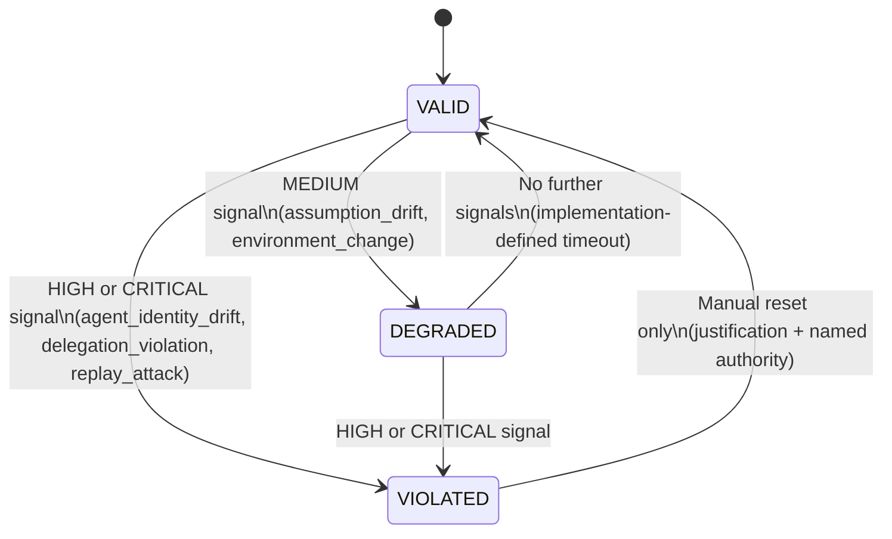

# DIS State Machine

Decision Integrity State (DIS) transitions.

## State definitions

| State | Meaning | Effect on proposals |
|---|---|---|
| `VALID` | All integrity signals within tolerance | Normal evaluation |
| `DEGRADED` | One or more MEDIUM signals received | All proposals DENIED (conservative default) |
| `VIOLATED` | HIGH or CRITICAL signal received | All proposals DENIED (mandatory) |

## Signal taxonomy

| Signal | Severity | Trigger |
|---|---|---|
| `assumption_drift` | MEDIUM | Declared assumption no longer true |
| `environment_change` | MEDIUM | Environment changed post-authorization |
| `agent_identity_drift` | HIGH | Agent identity cannot be verified |
| `delegation_violation` | HIGH | Authority chain broken or exceeded |
| `replay_attack` | CRITICAL | Previously-used ADO submitted again |

## Reset requirement

`VIOLATED → VALID` requires:
- Non-empty `justification` string
- Named `human_authority` identifier

This cannot be bypassed programmatically. The reset is logged with timestamp, old state, new state, justification, and authority.
