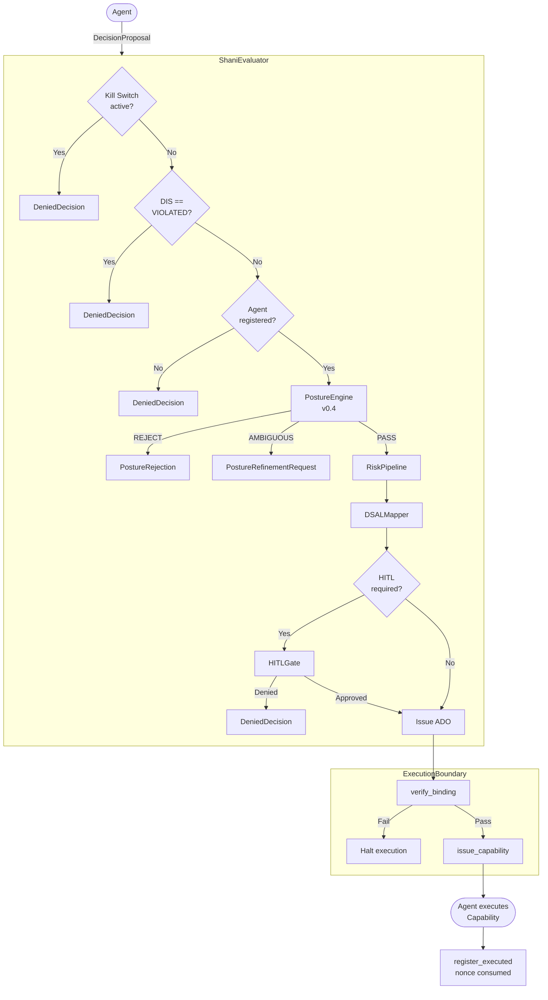

# Evaluation Pipeline

End-to-end decision evaluation flow in Shani.

## Stage descriptions

| Stage | Module | Purpose |
|---|---|---|
| Kill Switch | `shani/core/evaluator.py` | Immediate halt — all proposals denied |
| DIS check | `shani/integrity/` | Deny if DIS is VIOLATED or DEGRADED |
| Agent registry | `shani/authority/policy.py` | Deny if agent not in `policy/decision_policy.yaml` |
| PostureEngine | `shani/posture/engine.py` | v0.4 Binding Layer pre-filter |
| EvidenceEvaluator | `shani/risk/evidence.py` | Source trust → quality_score |
| RiskAssessor | `shani/risk/assessor.py` | Multi-dimensional risk_score (0.0–1.0) |
| RuleEngine | `shani/risk/rules.py` | Hard denials (irreversible critical, etc.) |
| DecisionSpaceAnalyzer | `shani/risk/decision_space.py` | Framing detection |
| DSALMapper | `shani/core/dsal.py` | risk_score → effective_dsal |
| HITLGate | `shani/hitl/gate.py` | Human approval if dsal >= threshold |
| verify_binding | `shani/boundary/hook.py` | Ed25519 signature + nonce + expiry |
| issue_capability | `shani/boundary/capability.py` | Capability token bound to ADO |
