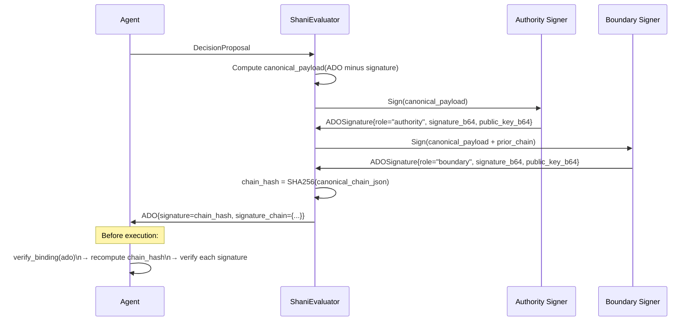

# ADO Signature Chain

Structure of the ADO v5.2 signature chain for multi-principal signing.



## Canonical payload fields (signed by all)

```
decision_id
proposal_hash
authority
authorized_dsal
delegation_rules {allowed_sub_decisions, max_child_dsal, max_depth, max_children}
nonce
issued_at
expires_at
exec_context {decision_type, intent_binding, parent_decision_id, constraints}
propagated_constraints
origin_org
```

## Attacks prevented by full payload coverage

| Attack | Field that prevents it |
|---|---|
| Authority rewrite | `authority` in payload |
| D-SAL escalation | `authorized_dsal` in payload |
| Delegation loosening | all four `delegation_rules` fields |
| Execution drift | `exec_context.intent_binding.target` |
| Nonce stripping | `nonce` in payload |
| Expiry extension | `expires_at` in payload |
| Cross-org constraint mutation | `propagated_constraints` in payload |
