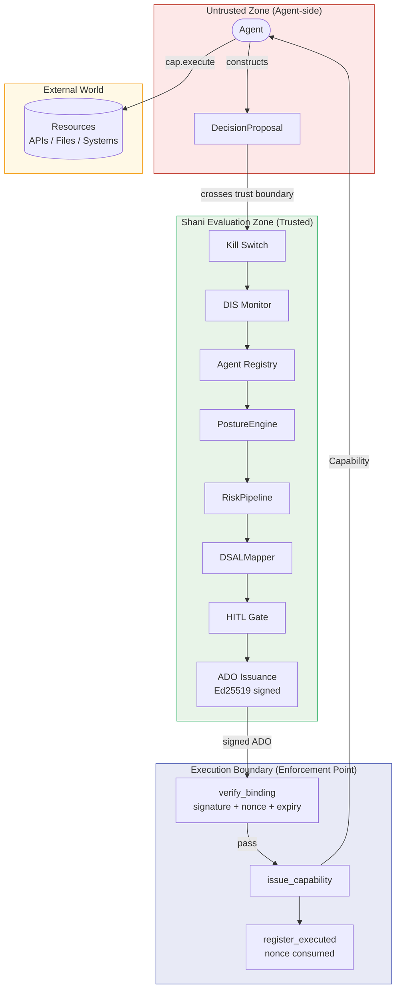

# Trust Boundary

Trust zones and component boundaries within the Shani decision governance layer.

## Zone definitions

| Zone | Trust level | What it contains |
|---|---|---|
| **Untrusted** | None — agent assertions are not trusted | `DecisionProposal` (all fields treated as claims to be verified) |
| **Shani Evaluation** | Fully trusted | Kill Switch, DIS, registry, PostureEngine, RiskPipeline, ADO signer |
| **Execution Boundary** | Fully trusted | `verify_binding`, `issue_capability`, nonce consumption |
| **External World** | Untrusted | APIs, file systems, external services |

## Trust crossing rules

| Crossing | Requirement |
|---|---|
| Agent → Shani | `DecisionProposal` schema validation; no agent-declared D-SAL accepted |
| Shani → Boundary | ADO must carry valid Ed25519 signature over canonical payload |
| Boundary → World | Only via `Capability` token issued by `ExecutionBoundary` |
| Cross-org (any) | `propagated_constraints` embedded and signed in ADO; `origin_org` set |

## What Shani does NOT trust

- Agent-declared `requested_dsal` — ignored; D-SAL is computed from risk
- Agent identity claims in proposal content — verified against agent registry
- Unsigned ADOs — `verify_binding` rejects any tampered or unsigned ADO
- Replayed ADOs — nonce store prevents any previously-executed ADO from re-entering
